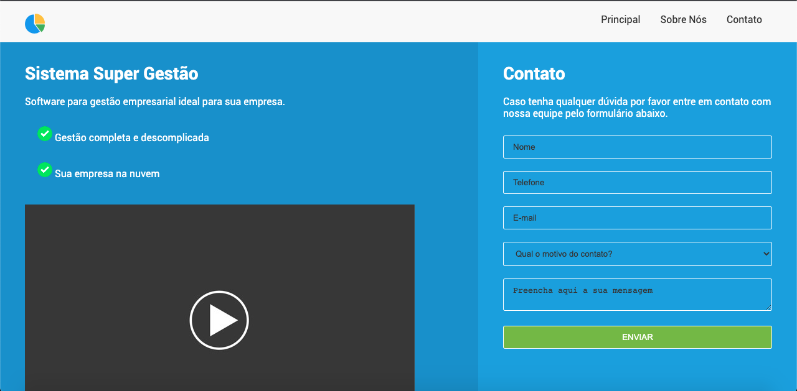
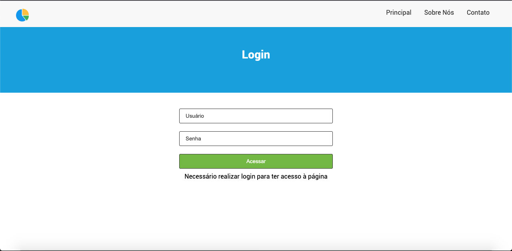
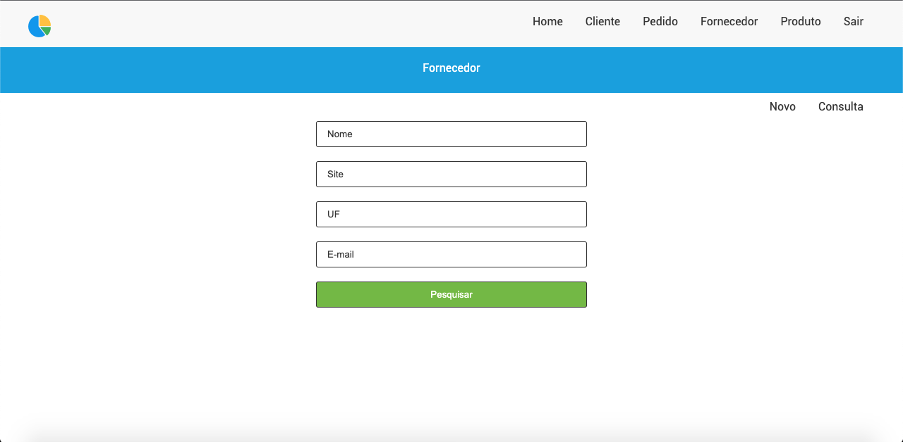
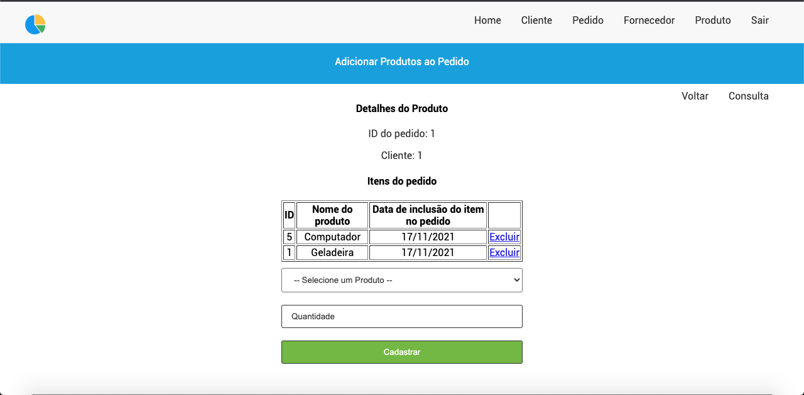

# Sistema 'Super Gestão'
 Sistema web feito em PHP com framework Laravel durante estudos.
  

O sistema utiliza banco MySQL e renderização das views através do Blade.
 

***Projeto em andamento.***

 
 

Algumas das telas do sistema: 

Tela inicial com seções de menu públicas disponíveis 

 

Depois temos a tela de Login, que dará acesso às funcionalidades propriamente ditas

 

Dentre opções do sistema, teremos cadasto, edição, remoção e consulta de uma série de elementos, dentre eles: fornecedores, clientes, produtos, pedidos...

 

Além disso, também temos a inclusão/exclusão de itens (produtos) dentro de um pedido, feito por meio de relacionamento do próprio Laravel.

 
 

O objetivo deste projeto é aprender mais sobre o framework Laravel, bem como o uso do Eloquent, portanto, o visual das telas não foi o foco da aplicação neste momento, mas sim o backend.
